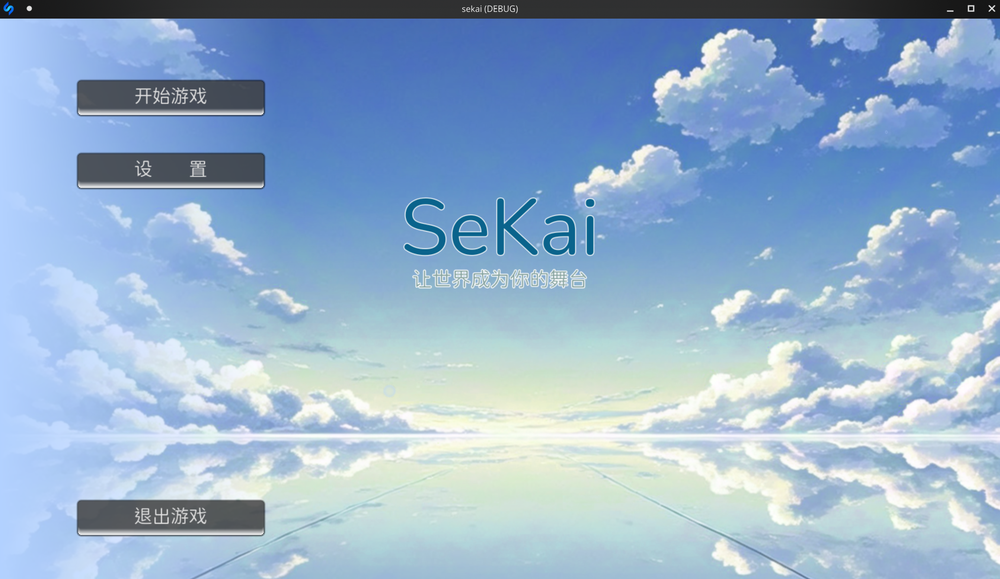

# Sekai-template

English|[中文](./README_CN.md)

Sekai-template is developed based on godot-mono and serves as the packaging template for the Sekai engine, enabling interpreted functionality by embedding the slang interpreter.



## Usage

### Direct Development

No environment setup is required. Simply download the [release](https://github.com/Sekai-Engine/template/releases) to start development immediately.

### Embedded Godot Integration

Or you can clone the repository directly and import it into godot-mono for further development:

```bash
git clone --depth 1 -b stable https://github.com/Sekai-Engine/sekai-template.git
cd sekai-template
```

Before writing scripts for the first time, you need to initialize the state and compiled language using the slang interpreter:

```bash
./slang edit en
```

After completing your script, you can package it into the `./ezgal/code/FlowData.cs` directory for compilation using slang as follows:

```bash
./slang build en
```

Programs compiled with Godot can run without depending on external folders. If you need to revert back to the editable file state, use the following command:

```bash
./slang edit en
```


