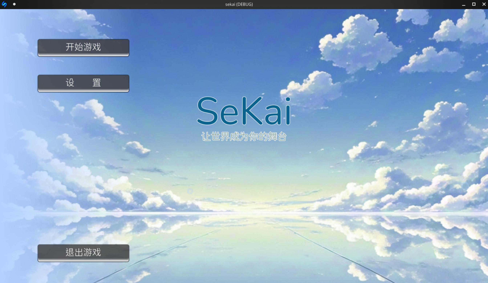

# Sekai-template

[English](./README.md)|中文

Sekai-template基于godot-mono开发，是Sekai引擎的打包模板，通过嵌入slang解释器实现解释功能.



## 使用

### 低代码开发

无需配置任何环境，直接下载[发行版](https://atomgit.com/Sekai-Engine/template/releases)进行开发。

### 深度嵌入

您可以直接克隆代码, 并导入到godot-mono中接着开发:

```bash
git clone https://atomgit.com/Sekai-Engine/template.git
cd template
```

首次开始编写脚本前需要使用slang解释器将状态与编译语言进行初始化:
```bash
./slang edit zh
```

在编写完成后想要打包为一个程序可以使用slang打包进`./ezgal/code/FlowData.cs`文件夹进行编译, 打包方式如下：

```bash
./slang build zh
```

godot编译的程序可以不依赖文件夹运行, 如果需要恢复到文件的编辑状态, 可以使用以下指令进行恢复:

```bash
./slang edit zh
```

